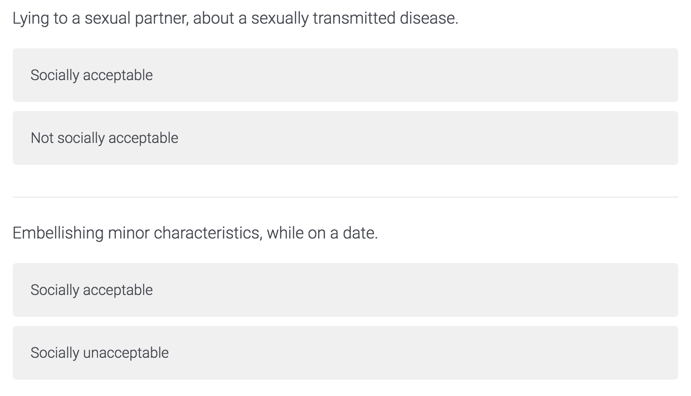
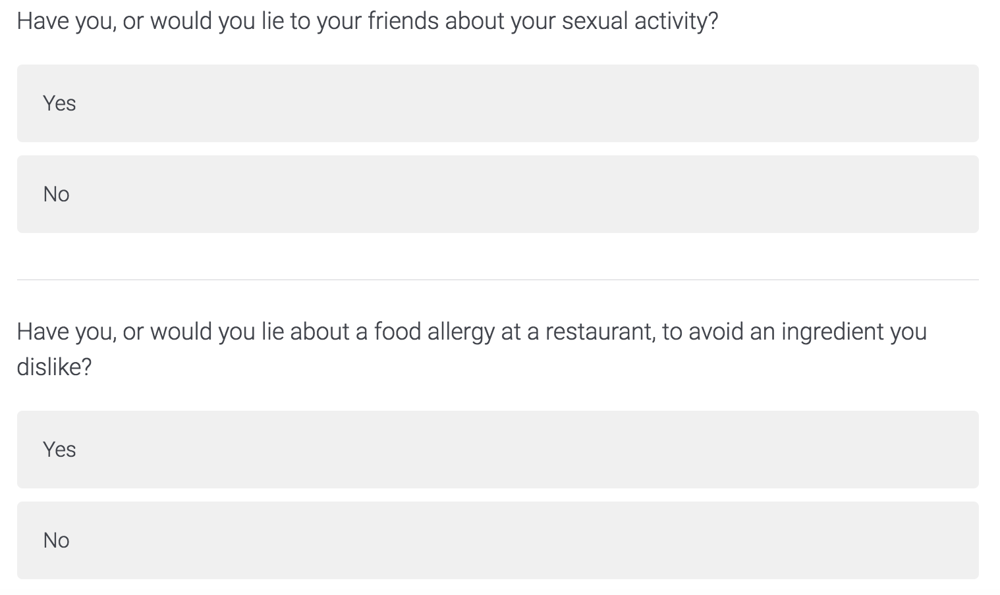
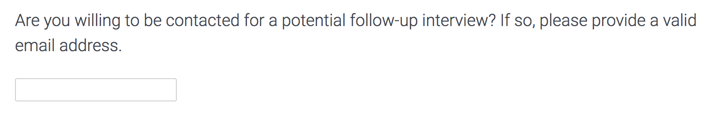

```{r setup, include=FALSE}
knitr::opts_chunk$set(echo = TRUE)
```

```{r initializer, echo=FALSE, message=FALSE, warning=FALSE}
#######################
# Initialize packages #
#######################
require(knitr, quietly=TRUE)
require(reshape2, quietly=TRUE)
require(data.table, quietly=TRUE)
require(ggplot2, quietly=TRUE)
require(stargazer, quietly=TRUE)
require(xtable, quietly=TRUE)

options(xtable.comment = FALSE)

#############
# Load data #
#############

# Generate vectors to identify different question types
presurvey_results <- fread("data/presurvey_results.csv")
q_positive <- presurvey_results[preferred_response == 1 & significant_05, as.character(variable)]
q_negative <- presurvey_results[preferred_response == 2 & significant_05, as.character(variable)]
q_selected <- c("Q1",  "Q2",  "Q3",  "Q5",  "Q6",  "Q7",  "Q9",  "Q10", 
                "Q11", "Q13", "Q14", "Q15", "Q16", "Q18", "Q19", "Q20")
q_all <- c("Q1",  "Q2",  "Q3",  "Q4",  "Q5",
           "Q6",  "Q7",  "Q8",  "Q9",  "Q10",
           "Q11", "Q12", "Q13", "Q14", "Q15", 
           "Q16", "Q17", "Q18", "Q19", "Q20")

# Load the responses
main_responses_long = fread("data/main_responses_long.csv")
main_responses_wide = fread("data/main_responses_wide.csv")

# Aggregate per-respondent answers to question types
main_responses_wide[, yes_all := rowSums(.SD), .SDcols=q_selected]
main_responses_wide[, yes_pos := rowSums(.SD), .SDcols=q_positive]
main_responses_wide[, yes_neg := rowSums(.SD), .SDcols=q_negative]

# Flag individual question answers with question type
questions_long = main_responses_long[
  variable %in% q_selected, 
  .(ResponseId, variable, value, "negative"=as.integer(variable %in% q_negative))
  ]


color_pos <- "#56B4E9"
color_neg <- "#E69F00"
```

# Introduction

Privacy is an inherently contextual concern. Particularly in the internet age, individuals are frequently comfortable revealing various subsets of their personal identity, depending on the particular circumstances, while avoiding full disclosure where possible. For example, an individual may be comfortable providing a retailer with full name and billing information, and allowing them to carefully track and analyze shopping behavior. The same person may share intimate details of intensely personal problems on a message board or blog, under the guise of a pseudonym or screen name. But they would vigorously protest any attempt to combine these two facets into a cohesive picture of their identity.

Nearly all online services, free or paid, require some amount of disclosure. Frequently this is as simple as an email address, a request most users likely find reasonable for unique identification, and the possibility of direct contact. However, use of this unique identifier also permits various services to combine their records on the same individual, a use case frequently tucked away in terms of use and privacy policies, and overlooked by users.

Some more savvy frequenters of these services may resort to a dump email, separate from their main personal or business-friendly identity, when they want to isolate a given behavior. However, technology is rapidly outpacing such efforts. The use of the same dump email repeatedly still allows a cohesive picture of behavior to be formed, and techniques such as browser fingerprinting can permit high probability linkage between multiple online identities.

In this study, we investigate whether an individual’s willingness to disclose identity information is linked to the level of invasiveness they perceive in other information being collected. Specifically, we request email disclosure, and ask a series of behavior questions of varying levels of sensitivity. We seek to understand whether users find invasive questioning a sufficient deterrent to disclosure—or whether email disclosure is sufficient deterrent from honestly answering the aforementioned questions.


# Background

While our experiment isn’t conducted in the presence of an interviewer, divulging of sensitive information is dependent on context. For example, in the case of surveys administered by physical interviewers, Tourangeau and Yan (2007) summarize that respondents are more likely to report sensitive information when questions are self administered, rather than being administered by an interviewer. A survey responder is less likely to disclose information if they interact with someone (such as an interviewer) who may learn something embarrassing or something that could be used to punish the survey responder.

Tourangeau and Yan (2007) also write that using familiar wording can increase reporting as well as question-wording strategies. For example, in collecting income, financial, and other numerical information, researchers sometimes use a technique called unfolding brackets to collect partial information from respondents who are unwilling or unable to provide exact amounts.

How much personal information is given depends on the context it is delivered through. Our experiment borrows some methodology from "Strangers on a Plane" [@strangers]. John, Acquisti, and Lowenstein (2011) conduct a series of experiment where the context in which sensitive questions are asked is changed. A total of four experiments are conducted. The first experiment changes how a sensitive question is asked, whether directly or indirectly. The experiment reveals that a responder is more likely to divulge private information when a question is asked indirectly. Therefore, the way a question is worded may get a surveyor more responses about personal information.

Other experiments are conducted in which responders answer personal questions on a professional-looking and an unprofessional-looking website versus a baseline website. They find that responders were more likely to reveal personal information in the unprofessional-looking website than they were in the professional one. Similarly, when such questions were asked on different types of survey interfaces (unprofessional versus professional), responders were more likely to have answered intrusive questions in the affirmative in the unprofessional-looking survey.

In their final experiment, John, Acquisti, and Lowenstein (2011) cue the responder to privacy concerns from the beginning and then see how the survey is responded to. They find that the difference in how unprofessional and professional surveys are responded to is eliminated when privacy concerns are relayed in the beginning. Signaling privacy concerns prior to a survey may change how questions are responded to, a characteristics that we hope to find in our experiment.

Further research on privacy and revelations by Spiekermann, Grossklags, and Berendt (2001) finds that stated preferences for privacy may not align with actual behaviors. They conduct an experiment where users privacy preferences are compared to their interactions on shopping websites. In their experiment, users were asked to fill a questionnaire regarding their privacy preferences. Then, users were given one of two privacy statement; one harsh and one soft, mentioning that their navigation patterns would be recorded during the shopping process. Participants had the option to leave at any time while shopping.

There was generally a correlation between users' navigation patterns and their privacy preferences. However, the same was not seen when it came to revealing information about themselves. User were more likely to reveal information about themselves, in contrast to their indicated privacy preferences.

Much of how privacy-related questions are answered depends on the mechanism used for asking them. Knijnenburg, Kobsa and Jin (2013) write that users tend to forgo their privacy calculus when presented with filled auto-completed forms. In an experiment they present users with three different types of auto-complete forms and observe how likely users are to use the auto-complete options. Despite selective privacy preferences, users are likely to over-disclose information when using the traditional auto-complete present on many web browsers.

The level of personal information revealed may be dependent on the audience. Quian and Scott (2007) look at bloggers and how much of their private information they choose to disclose. They find that bloggers revelation of personal details is contingent on how well they know their target audience. The more personally acquainted a blogger is with their audience, they more likely they are to disclose personal details about themselves.

Finally, revelation may be dependent on how you see your traits vis-a-vis societal acceptance of norms. Huberman and Adar find that responders are less likely to disclose information when their response has higher deviation from the norm. They conduct an experiment where experimenters auction personal information about themselves. They find that when a trait is more socially undesirable, the individual demands more compensation for revealing it. For example, the more a persons weight was above the median, the higher the compensation they would demand. Their work shows us how different social scenarios and indicators may be valued differently based on how much the trait is considered a deviation from the norm.

Our experiment touches on many of these issues as users are asked personal questions about social behaviors and are asked to provide personal contact information. 


# Experiment

## Overview

The specific goal of this study is to examine the interaction, in both directions, of personal identity disclosure on the response to a variety of questions. How do revelations about one’s past behavior, initially made anonymously, affect their willingness to voluntarily identify and permit future contact? And, conversely, how do the responses to the same kinds of questions change when the respondent has already provided that same information?

The core of the design is to ask respondents for the answers to a variety of questions, which have been pre-classified by their sensitivity and perceived invasiveness, with the intent to answer the following high level research questions:

* RQ1: What is the impact of the timing of our identity disclosure request on all responses?
* RQ2: What is the impact of question types on question responses?
* RQ3: What is the impact of question responses on later identity disclosure?
* RQ4: What is the impact of prior identity disclosure on question responses?

The answers to these questions, taken together, can help compose a useful picture of the fundamental interactions between behavioral honesty and anonymity.

## Question Selection

The basis of our analysis is a framework of questions determined to be at different levels of “sensitivity”. Tourangeau and Yan (2007) offer several models of question sensitivity, including intrusiveness and threat of disclosure. Here we focus on their third notion, that of “social desirability.” Given clear social norms about specific behavior, conforming to those norms is socially desirable, and diverging from them is undesirable. Questions that inquire directly about socially undesirable behavior are perceived as more sensitive. In particular, this perception of sensitivity is linked to an affirmative admission. Someone who has, in truth, not violated a social norm is unlikely to find the question sensitive—that is, unless they are offended by the nature of the question itself, violating intrusiveness rather than desirability.

There is some concern that a clear disparity in the desirability of behaviors mentioned in the survey may encourage response bias. If some questions are about blatantly positive behaviors, while others address extreme violations of social norms, respondents may be more likely to cater their answers to perception of these extremes. To combat this, we narrow the gap in social desirability, by focusing on desirable and undesirable forms of a single kind of behavior. In this case, all questions formulated are on different kinds of lies and deception. Social norms consider lies to be generally undesirable, but so-called “white lies”, are much more accepted.

Focusing on a narrow band of behavior also aids in obfuscating the intent of the survey. We are able to introduce the survey with a plausible research topic on general deceptive behavior in the population rather than a random assortment of behaviors that leaves a subject curious, and searching for the pattern.


### Pre-Survey

Central to a successful study of these issues is the classification of behaviors as either desirable or undesirable.  To develop the question list for our main experiment, we conducted a pre-survey, establishing a statistical basis for our social desirability rankings, and helping avoid inserting our own biases and social constructs into the classification process.

#### Methodology

An initial list of twenty different kinds of lies was composed by us (enumerated, with results, in Table 2 below). Some of these behaviors were deliberately selected based on prior belief regarding their social desirability, in the hopes of guaranteeing a wide range of options. However, these priors were not incorporated into later analysis, to allow for the possibility that our own notions of social desirability may not be shared by the population at large.

In order to prevent question overload, each respondent was shown a randomly selected subset of five behaviors. Each question asked whether or not they believed the given behavior was considered socially acceptable (Fig 1). All responses were then aggregated, and each behavior analyzed using a binomial test. The null hypothesis of this test was a probability of 0.5—that each behavior would be divided evenly between desirable and undesirable. Any questions with a statistically significant divergence (alpha = 0.05) from the middle would be flagged with the majority vote. These questions would be used in the main survey, unless a severe class imbalance between question types arose.



Since demographic details or specific subgroups are not the focus of this study, pre-survey respondents were recruited, and compensated for their time, via Amazon Mechanical Turk. In an attempt to distill somewhat consistent social norms from a single culture, subjects were restricted to English-speaking, U.S.-based workers.

#### Results

253 pre-survey responses were collected, with an average of 63.25 responses per behavior. Due to random assignment, some behaviors were seen more often, and some less (Table 1), but all hovered in an acceptable range.

```{r echo=FALSE, results="asis"}
presurvey_rates <- presurvey_results[, .(
  "Total Responses"=sum(total_responses), 
  "Avg. Response Rate"=mean(total_responses), 
  "Min. Response Rate"=min(total_responses), 
  "Max. Response Rate"=max(total_responses)
  )]

kable(t(presurvey_rates), caption="Presurvey Response Rate")
```

Analysis provided sixteen statistically significant behavior evaluations. Ten were deemed socially acceptable, and six unacceptable (Table 2, Figure 2). Some of these results were within our expectations—the socially acceptable nature of encouraging belief in Santa Claus is no surprise, for example.

Of particular note was the dichotomy of lying about income (acceptable), and lying on a tax return (unacceptable). From an information perspective, these are essentially the same deception. They vary only in who they are told to: a non-specific, general audience, or the government.
 

```{r echo=FALSE, results="asis"}
questions <- presurvey_results[, .(
  "Question"=question,
  "Acceptable"=ifelse(preferred_response==1, "Y", "N"),
  "Significant"=ifelse(p_value <= 0.01, "***", ifelse(p_value <= 0.05, "**", ifelse(p_value <= 0.1, "*", "-")))
  )]
print(xtable(questions, align="lp{30em}rl", caption="Presurvey Questions and Results"))
```

```{r echo=FALSE, fig.cap="Presurvey Responses"}
ggplot(presurvey_results) +
  geom_col(aes(factor(variable, levels=q_all), response_1, alpha=(significant_05 & preferred_response == 1), fill="pos")) +
  geom_col(aes(factor(variable, levels=q_all), response_2*-1, alpha=(significant_05 & preferred_response == 2), fill="neg")) +
  scale_y_continuous(labels=abs) +
  scale_alpha_discrete(name="p < .05", range=c(0.5, 1.0)) +
  scale_fill_manual(name="Question Type", values=c(pos=color_pos, neg=color_neg), labels=c(pos="Socially Acceptable", neg="Socially Unacceptable")) +
  theme_minimal() +
  theme(axis.text.x=element_text(angle=45, hjust=1)) +
  theme(text=element_text(family="serif")) +
  labs(x="Question", y="Presurvey Responses")
```

### Question Presentation

There are several possible ways to form questions from a list of behaviors. John, Acquisti, and Lowenstein (2011) compare direct to indirect questioning. Rather than directly asking about a given behavior, their method of indirect questioning provides multiple locations to rank the behavior ethically, based on whether the respondent has performed that behavior in the past. They find that this method increases admission rates for questionable behaviors.

For purposes of our study, a higher baseline admission rate is not necessarily beneficial. Among our research goals is an investigation of how prior email disclosure impacts admission rates of socially undesirable behaviors. For this reason, and for simplicity of analysis, we have elected to use direct questioning. Each behavior is presented as a simple yes/no question, of the format, “Have you, or would you, lie about x?” The inclusion of “or would you” attempts to account for cases where the respondent has not, in the course of their normal life, been presented the opportunity for the behavior. For example, someone who has never suffered from a sexually transmitted disease would not have had the opportunity to lie about one.

## Main Survey

Unlike the pre-survey, we elected to present the full course of available questions to all respondents. By ensuring that everyone sees the full spread of sensitive questions—in addition to the others—we maximize the possibility of seeing a treatment effect between the groups. There is some imbalance between the groups—10 desirable behaviors, and 6 undesirable—but this was not deemed extreme enough to merit editing of the list.

The survey begins with a brief description of the purpose of the survey, and instructions on the remaining survey. It is presented as as study of “prevalence of different forms of lying and deceptive behavior in the population.” Visitors are instructed to answer yes or no, based on past behavior, and to truthfully consider any behaviors which they have not yet had the opportunity to enact (Figure 3).

Once the survey begins in earnest, each respondent is randomly placed into one of two groups, referred to hereafter as the “pre” and “post” groups. All are asked optionally for their email address, nominally for the purpose of conducting future follow-up research (Figure 4).





As will be addressed in section 5 below, email is an imperfect proxy for personally identifiable information. Despite this, we determined that it would be sufficiently revelator to provoke possible discomfort, while also making sense as a plausible query to attach to an otherwise anonymous survey, from the respondents’ perspectives.

The pre group is presented with this request for email immediately after the instructions. Then both groups are given the behavior questions, randomly ordered, and presented as the simple yes or no responses as described above. Finally, the post group is asked for their email address, using an identical request as has already been seen by the pre group.

To maximize usable data from our limited sample size, we eschew a dedicated control group. Instead, the post group serves as a control for questions about the effect of email disclosure on question response—they have not yet been asked for identification when they are answering the questions, and thus would be have as someone who is never so asked—and the pre group serves as a control for questions about the effect of question response on email disclosure—likewise, they have not yet seen questions prior to their decision to disclose their address.

As with the pre-survey, respondents were recruited from Mechanical Turk, and paid an appropriate market-rate fee, in keeping with estimated task time, and the national minimum wage, with the hope of securing high quality results.


# Results

## Hypotheses for Analysis

Based on the original research questions, and the specific formulation of the questions as described above, we have developed a specific sequence of hypotheses to test on the acquired survey data.

### What is the impact of the timing of our identity disclosure request on all responses?

- **H1:** Assignment to the pre or post group will affect email disclosure rates.
- **H2:** Assignment to the pre or post group will affect the rate of "Yes" answers to all behavior questions.
- **H3:** Assignment to the pre or post group will affect the rate of "Yes" answers to questions classified as sensitive

### What is the impact of question types on question responses?

- **H4:** The classification of a question as sensitive will impact the number of "Yes" answers it receives.

### What is the impact of question responses on later identity disclosure?

- **H5:** In the post group, the number of "Yes" answers to all behavior questions will impact the email disclosure rate.
- **H6:** In the post group, the number of "Yes" answers to sensitive behavior questions will impact the email disclosure rate.

### What is the impact of prior identity disclosure on question responses?

- **H7:** In the pre group, the email disclosure rate will impact the number of "Yes" answers to all questions.
- **H8:** In the pre group, the email disclosure rate will impact the number of "Yes" answers to sensitive questions.


## Responses

The main survey received 301 total responses, all recruited from Mechanical Turk. 215 respondents provided email addresses in the survey. One additional respondent reached out, post-survey, to report a problem providing their email address, but it was not clear which group or set of responses they were linked to, so that disclosure is not included here.

```{r echo=FALSE, results="asis"}
survey_summary <- main_responses_wide[, .(
  "Total Responses"=.N, 
  "Emails Collected"=sum(email), 
  "Avg Yes Answers (max: 20)"=round(sum(yes_all, na.rm=TRUE)/.N, 2)
  )]
kable(survey_summary, caption="Main survey response rate")
```

The pre and post groups were created via simple random assignment, wherein each respondent’s assignment was independent of all others. As such, the two treatment groups are unevenly split—46/54 rather than 50/50. The proportions are close enough to 50% that sample size is not a concern.

```{r echo=FALSE, results="asis"}
survey_summary_group <- main_responses_wide[, .(
  "Total Responses"=.N, 
  "Emails Collected"=sum(email), 
  "Avg Yes Answers (max: 20)"=round(sum(yes_all, na.rm=TRUE)/.N, 2)
  ), by=list("Treatment Time"=ifelse(email_timing==0, "Pre", "Post"))]
kable(survey_summary_group, caption="Treatment summary")
```

## Hypothesis Testing

All hypotheses were analyzed using linear regression models. However, since no demographic covariates were included, the regressions are all essentially t-tests.

### Impact of disclosure request timing

The first analysis covers all respondents, based on group assignment, pre or post. The survey results show no significant difference in any responses, caused by the timing of the request for email disclosure. Disclosure rate, admission to behaviors in general, and admissions to socially undesirable behaviors on sensitive questions all show no notable effect.

```{r echo=FALSE, results="asis"}
h1 <- lm(email ~ email_timing, main_responses_wide)
h2 <- lm(yes_all ~ email_timing, main_responses_wide)
h3 <- lm(yes_neg ~ email_timing, main_responses_wide)

stargazer(h1, h2, h3, header=FALSE, title="Impact of disclosure timing",
          covariate.labels=c("Email request timing (post)", "Constant"),
          dep.var.labels=c("Email disclosure", "Yes answers (all questions)", "Yes answers (sensitive questions)")
          ) 
```

### Impact of question type on responses

Our second analysis steps away from each respondent's survey as a unit, and focuses on each individual question, across all responses. Sensitivity of the question does show a highly significant (p < 0.01), medium sized (R^2 = 0.127) effect on affirmative admission rates. The negative direction indicates that respondents are less likely to admit to socially desirable behaviors. Figure 5 demonstrates the clear difference between the sensitive and non-sensitive questions.

Unfortunately, this study is not equipped to determine whether the effect is due to a reduced willingness to admit behaviors of this nature, or the population at large is genuinely less likely to participate in said behaviors. Given that the evaluation as undesirable is rooted in social norms, the latter seems likely, but any attempt at a ground truth measure of most of these behaviors would be reliant on voluntary disclosure, and thus largely unreliable.

```{r echo=FALSE, results="asis"}
h4 <- lm(value ~ negative, questions_long)

stargazer(h4, header=FALSE, title="Impact of question type on responses",
         covariate.labels=c("Question marked as sensitive", "Constant"),
         dep.var.labels=c("Yes answers")
         )
```

```{r echo=FALSE, fig.cap="Question types and responses"}
ggplot(
  questions_long[, .("value"=sum(value, na.rm=TRUE)), by=variable], 
  aes(factor(variable, levels=q_all), value, fill=(variable %in% q_positive))
  ) +
  geom_col() +
  scale_fill_manual(name="Question Type", values=c(color_neg, color_pos), labels=c("Socially Unacceptable", "Socially Acceptable")) +
  labs(x="Question", y="Yes answers") +
  theme_minimal() +
  theme(axis.text.x=element_text(angle=45, hjust=1)) +
  theme(text=element_text(family="serif"))
```

### Impact of question responses on email disclosure

Next, we focus on the post group, to test whether response patterns in the survey questions affect later willingness to disclose identity. Our results show no significant relationship between behavior admissions—desirable or undesirable—and eventual email disclosure. In fact, in both cases an increase in "Yes" response rate actually *increased* disclosure, though not in a statistically meaningful way.

```{r echo=FALSE, results="asis"}
h5 <- lm(email ~ yes_all, main_responses_wide[email_timing==1])
h6 <- lm(email ~ yes_neg, main_responses_wide[email_timing==1])

stargazer(h5, h6, header=FALSE, title="Impact of questions on email disclosure",
          covariate.labels=c("Yes answers (all questions)", "Yes answers (sensitive questions)", "Constant"),
          dep.var.labels=c("Email disclosure")
          )
```

### Impact of email disclosure on question responses

Finally, we turn to the pre group and reverse the last analysis, instead testing whether prior disclosure of identity information affects later behavior admission response. Again, we find no significant change in the response rate to either questions at large, or sensitive questions in particular, dependent on email disclosure.

```{r echo=FALSE, results="asis"}
h7 <- lm(yes_all ~ email, main_responses_wide[email_timing==0])
h8 <- lm(yes_neg ~ email, main_responses_wide[email_timing==0])

stargazer(h7, h8, header=FALSE, title="Impact of email disclosure on questions",
          covariate.labels=c("Email disclosure", "Constant"),
          dep.var.labels=c("Yes answers (all questions)", "Yes answers (negative questions)")
          )
```

## Discussion

In general, this study found no interactions of note between email disclosure and behavior admission. Admitting to socially undesirable behaviors did not affect a respondent's willingness to be provide contact information for future research. Conversely, having already provided such information did not affect their admissions.

Our single statistically significant result, that question sensitivity affects response rate, is limited in its utility, because it is not clear whether the actual cause of lowered response rate is the sensitivity of the question, or the root social norm driving its evaluation as sensitive.

In section 5 we review several possible reasons why this study may have failed to find any interactions, beyond the clear option that there simply are none.

# Problems

Though we accept the results of our study as statistically valid, and would hesitate to re-run the survey in search of better results, it remains possible that treatment effects do exist in at least some of these cases, but were not revealed by our research efforts. Several potential issues with the experimental design may have worked to suppress inherent differences between the pre and post groups.

First, the behaviors presented may be too close together. The statistical significance measured on the pre-survey does not necessarily indicate just how far apart in desirability the different questions are. Since all the behaviors are of the same general type—lying and deception—if the questions on each side of the line are too similar on a respondent’s internal social desirability scale, the effect size between them would be very small, requiring a larger sample size to detect. The binomial test does calculate an estimated probability that could be used to rank behaviors, but our relatively short question list did not lend itself to this.

This effect could likely be mitigated by a more thorough pre-survey. Expert opinions may be solicited, and pre-existing research consulted, on a wider range of deceptive behavior. With a larger number of options, selections from the pre-survey results could be more discerning, filtered to only utilize those with a more extreme effect, while ignoring those questions likely to be just over the line of statistical significance.

Additionally, deceptive behavior in general has a negative connotation, and bias toward the undesirable. Since the general topic of the survey was revealed to the respondent prior to the first question, even the users in the pre group would have had a general idea that they may be asked sensitive questions, prior to being prompted for their email address. Future efforts ought to be more vague about the nature of the behaviors to be solicited in the main body of the survey, to avoid this bias.

Finally, email addresses may simply not be personal enough to prompt a reaction. This is a particular risk for a study recruiting from Mechanical Turk. Many users of such modern internet tools maintain secondary, anonymous email addresses, not associated with their identity or professional lives, strictly for use when signing up for online services. This serves both to protect their identity and evade inbox clutter.

Review of message boards in use by “Turkers” shows several individuals who use these secondary addresses explicitly for surveys that request contact information for follow-up. Without a direct association to their identity, respondents may feel no qualms about divulging this detail, regardless of the questions asked and answered.

This suggests either that more personal information should be solicited—within reason, and within Amazon’s usage policy—or that Mechanical Turk is not the appropriate recruitment venue for a study of this type. For example, a more traditional university recruitment would permit the study to request the respondent’s official email address, guaranteeing identifiability in a way that is impractical with a broad, truly anonymous sample.

# Future Work

In addition to addressing flaws in the original design, several extensions are possible to gain deeper insight into these interactions—assuming for the moment that such interactions do exist.

Treatment of social desirability as a strictly binary consideration limits the amount of detail that can be solicited. Forcing a yes/no answer can be useful when trying to maximize observable effect, but use of an ordinal scale provides room to quantify the level of desirability in each question answer and overall survey response. This provides a more nuanced view of the effect on email disclosure.

This task of assigning desirability scores to each individual survey might be accomplished in one of two ways. If the binary evaluation of each behavior remains important, each respondent could instead be shown a random subset of questions. A given survey response could then be scored based on how many of the presented questions were rated undesirable.

Additionally, as mentioned above, starting from a broader set of behaviors, and a more thorough pre-survey, would provide more insight into just how far any given behavior is from the center line of desirability, providing the researchers with an ordered ranking of behaviors.


\newpage

# References